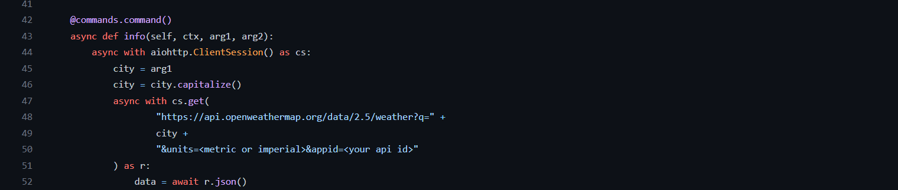

# Weather Bot   
**Weather Bot** is a discord bot written in `Python Language` and is maintained and hosted in `Heroku` by <a href="https://www.instagram.com/iam__amansingh/">Aman</a>. It can give real-time information of the weather of any city. 

#### Services it can provide:
- ☁️ Weather description
- 🌡️ Temperature (including min and max temperatures)
- 💧 Humidity
- 💦 Precipitation
- 📌 Coordinates
- 📝 5-day weather forecast `in development`

## Commands
**Weather Bot** uses 'info' as prefix. 
`info <city name> <argument>` this is a valid command for this bot. City name should be valid and also if a city name has `two` words for example __New York__ then its valid name becomes __NewYork__ or __newyork__ i.e without spaces.

|    Argument |                      Output                                                |
|:------------:|:-------------------------------------------------------------------------:|
|    `all`     | Returns each and every weather data for an area.                          |
|    `weather` | Returns only the weather description for an area.                         |
|    `temp`    | Returns the temperature for an area including min and max temperatures    |
|    `humidity`| Returns only the humidity for an area.                                    |
|    `prep`    | Returns only the precipitation data for an area.                          |
|    `coord`   | Returns coordinates for an area.                                          |

## OpenWeather API
<a href="https://openweathermap.org/api">OpenWeather</a> offers access to current weather data for any location on Earth including over 200,000 cities! They collect and process weather data from different sources such as global and local weather models, satellites, radars and a vast network of weather stations. Data is available in `JSON`, `XML`, or `HTML` format.

**Weather Bot** also uses OpenWeather api to get these weather data.  

### How to get started
First of all, you need to subscribe to one of their plans. There are both free and paid plans. The plan that this bot uses is a free one, here is a <a href="https://openweathermap.org/price">link</a> for that plan.

**My plan description:**
- Hourly forecast: `unavailable` 
- Daily forecast:`unavailable`
- Calls per minute: `60`
- 3 hour forecast: `5 days`

After choosing a plan get your own `API KEYS` and paste to the `weather.py` file as shown below:  

In line number `50` and also change the units as per your needs.

